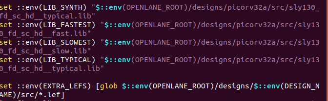

# Advanced Physical Design 

 

## Table of Content
<h3>Part 1: Inception of open-source EDA, OpenLANE and Sky130 PDK</h3>

1. How to talk to computers
2. SoC design and OpenLANE
3. Starting RISC-V SoC Reference design
4. Get familiar to open-source EDA tools

<h3>Part 2: Good floorplan vs bad floorplan and Introduction to library cells</h3>

1. Chip Floor planning considerations
2. Library Binding and Placement
3. Cell design and characterization flows
4. General timing characterization parameters

<h3>Part 3: Design library cell using Magic Layout and Ngspice characterization</h3>

1. Labs for CMOS inverter ngspice simulations
2. Inception of Layout – CMOS fabrication process
3. Sky130 Tech File Labs

<h3>Part 4: Pre-layout timing analysis and importance of good clock tree</h3>

1. Timing modelling using delay tables
2. Timing analysis with ideal clocks using openSTA
3. Clock tree synthesis TritonCTS and signal integrity
4. Timing analysis with real clocks using openSTA

<h3>Part 5: Final steps for RTL2GDS using OpenSTA</h3>

1. Routing and design rule check (DRC)
2. PNR interactive flow tutorial


## Introduction
This project is a product of the 5 day workshop conducted by VLSI Sstem Design on Advanced Physical Design. The focus is to complete the RTL to GDSII flow for PicoRV32 which is RISCV based core. The following steps will be carrried out:
+ Synthesis
+ Floorplan
+ Placement
+ Clock Tree Synthesis
+ Routing


## Tools Used
All tools used in this project are open sourced
+ OpenLANE: It is an automated RTL to GDSII (Registered Transfer Level to Graphic Data System version II) flow that is built on top of several open source tools, aiming to be a fully automated ASIC (Application-Specific Integrated Circuit) flow. OpenLANE is intended to produce clean GDSII without any human intervention, although, there is an interactive mode available to allow for custom modifications and design tuning. The OpenLANE flow involves several stages, including synthesis, floorplanning, placement, routing, and checking for manufacturability (DRC). Here's a brief overview of these stages:

  - **Synthesis:** The input RTL design (in Verilog, for instance) is transformed into a gate-level representation. Yosys is the tool used for this.

  - **Floorplanning:** Arrangement of macro blocks and determining the shape and size of the chip. OpenROAD is one of the tools used for this.

  - **Placement:** Determines the exact location of standard cells in the layout. OpenROAD is again the tool used for this.

  - **Routing:** The interconnections between the cells are created, forming a complete network of paths for the design.

  - **DRC (Design Rule Checking):** The final layout is checked against a set of design rules to ensure it can be accurately manufactured.
 
 
+ SKY130 PDK: The Sky130 Process Design Kit (PDK) is a significant offering from SkyWater Technology. It's known as the world's first manufacturable, open-source PDK. A PDK (Process Design Kit) is essential for chip design as it describes how a particular fabrication technology can be used for designing integrated circuits. SkyWater's Sky130 PDK provides a 130-nanometer fabrication process that can be used to design a wide range of ICs (Integrated Circuits). It is particularly notable because of its open-source nature. Prior to the release of Sky130 PDK, virtually all PDKs were proprietary, making this a major step towards enabling open-source hardware and democratizing IC design. Key aspects of the Sky130 PDK include:
  - **130-nanometer process:** The 130nm process allows for reasonable performance and power levels while remaining accessible for smaller design teams.
  
  - **Open-source:** The Sky130 PDK is open-source and available for anyone to use. This is a major departure from traditional PDKs, which are typically proprietary.
  
  - **Versatility:** The Sky130 PDK is suitable for a wide range of designs, including mixed-signal and analog, radio frequency (RF), and ultra-low power applications.
  
  - **Manufacturable:** The Sky130 PDK is not just a theoretical or educational tool; it can be used to create designs that can actually be manufactured by SkyWater's foundry services.
  
  
+ Magic: Magic is a venerable VLSI (Very-Large-Scale Integration) layout tool, written in the 1980s at the University of California, Berkeley. It is widely known in academia for its interactive mode, which allowed designers to directly manipulate design layouts. Key Features of Magic:

  + **IC Layout:** Magic is a key tool in designing the layout of integrated circuits (ICs) in VLSI.

  + **Technology-Agnostic:** It is adaptable to various IC fabrication technology rules, such as SCMOS, and has been updated for deep sub-micron designs.

  + **Interactive:** Magic is not just a drawing tool, it's an intelligent layout editor. As the user manipulates the design layout, Magic continuously performs design rule checking (DRC) to ensure that the layout obeys the specific rules of the fabrication process.

  + **Extensible:** Magic is extensible and has been used as a base for several IC design automation tools.

  + **CIF and GDS Conversion:** Magic supports CIF (Caltech Intermediate Form) and GDS (Graphic Data System) formats, which are common formats for IC design files.

  + **Open Source:** Magic is open-source software, which means it's freely available for use and modification.

+ Ngspice: It is a mixed-level/mixed-signal electronic circuit simulator. It is a successor of the popular SPICE simulator (Simulation Program with Integrated Circuit Emphasis), and was developed by a collective effort from many developers from around the world.Here are some key features and information about ngspice:

  + **Mixed-Level/Mixed-Signal Simulation:** ngspice is capable of simulating both digital and analog circuits, and can perform mixed-level simulations where these two types of circuits interact.

  + **Open-Source:** ngspice is open-source software. This means that it is freely available for use and modification.

  + **SPICE-Compatible:** Being a successor to SPICE, ngspice is fully SPICE-compatible. This means that it can run SPICE simulation models and netlists.

  + **Models:** ngspice includes several semiconductor device models, which allows it to simulate a wide variety of circuits. It also supports user-defined models.

  + **Interactive Mode:** In addition to batch-mode simulation, ngspice also supports interactive mode, which allows users to change parameters on the fly and see the results immediately.

  + **Extensions:** Over the standard SPICE tool, ngspice provides several extensions, including additional models for modern devices, XSPICE code models, and more.

  + **Integration:** ngspice can be interfaced with external software for further processing and analysis of simulation results. It can also be embedded into other applications as a simulation engine.

+ OpenSTA: Open Static Timing Analyzer, is an open-source tool used for the static timing analysis of digital circuits. It is a part of the OpenROAD project, which is an initiative to develop a complete open-source toolchain for digital integrated circuit (IC) design. Key Aspects of OpenSTA:

  + **Static Timing Analysis (STA):** OpenSTA is used to perform STA, a method of validating the timing performance of a digital circuit without requiring a simulation.

  + **Critical Path Analysis:** OpenSTA can identify critical paths in a design, i.e., the longest path through the circuit, which determines the maximum possible clock speed of the circuit.

  + **Reporting:** OpenSTA can generate detailed reports of the timing characteristics of a digital circuit. This includes information about setup and hold violations, path delays, and slack times.

  + **Scripting:** OpenSTA supports scripting which allows users to automate various tasks within the tool.

  + **Integration:** As part of the OpenROAD project, OpenSTA is designed to be integrated with other tools in the toolchain. It can also read industry-standard file formats like Liberty, Verilog, and SDF.
 

## Methodology
<h2>Part 1: Inception of open-source EDA, OpenLANE and Sky130 PDK</h2>

Start the ORacle virtual machine using the VSD image.
Start the required docker container by navigating to openlane work directory and typing docker.
Files in the openlane work directory.

Start OpenLANE b using he following command
```./flow.tcl -interactive```

prepare the design and load it into the openlane work space with an appropriate tag:
```prep -design picorv32 -tag trail_run1```

Play with he design by changing the clock period (within the work space only). Be sure to set back to defaul value once done, else might cause issues.


Run synthesis for  
```run_synthesis -design picorv32a -tag trial_run1```


<h2>Part 2: Good floorplan vs bad floorplan and Introduction to library cells</h2>


magic -T /home/vsduser/Desktop/work/tools/openlane_working_dir/pdks/sky130A/libs.tech/magic/sky130A.tech lef read ../../tmp/merged.lef def read ../floorplan/picorv32a.floorplan.def


/home/vsduser/Desktop/work/tools/openlane_working_dir/pdks/sky130A/libs.tech/magic/sky130A.tech lef read ../../tmp/merged.lef def read ../placement/picorv32a.placement.def

<h2>Part 3: Design library cell using Magic Layout and Ngspice characterization</h2>


Move lef and lib files to src in designs/picorv32 
cp <source> <desination>
set lefs [glob $::env(DESIGN_DIR)/src/*.lef]
add_lefs -src $lefs


<h2>Part 4: Pre-layout timing analysis and importance of good clock tree</h2>




write_verilog designs/picorv32a/runs/trial_run3/results/synthesis/picorv32a.synthesis.def
run_cts -design picorv32a -tag trial_run3 -overwrite

read_lef designs/picorv32a/runs/trial_run3/tmp/merged.lef 
read_lef designs/picorv32a/runs/trial_run3/results/cts/picorv32a.cts.def
write_db picorv32_cts.db


source scripts/sta.tcl

<h2>Part 5: Final steps for RTL2GDS using OpenSTA</h2>


 ```python3 --lef_file ../../../../../scripts/spef_extractor/main.py --def_file ../tmp/merged.lef ./routing/picorv32a.def```


## Acknowledgements

This project wouldn't have been possible without the help of:

- [Kunal Ghosh](https://github.com/kunalg123) - Co-founder VSD Corp. Pvt. Ltd 
- [Nickson Hose](https://github.com/nickson-jose/) - Teaching Assistant VSD Corp. Pvt. Ltd) (link to their GitHub or website)
