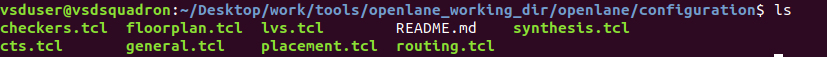

# Advanced Physical Design 

## Table of Contents
<h3>Part 1: Inception of open-source EDA, OpenLANE and Sky130 PDK</h3>
1. How to talk to computers
2. SoC design and OpenLANE
3. Starting RISC-V SoC Reference design
4. Get familiar to open-source EDA tools

<h3>Part 2: Good floorplan vs bad floorplan and Introduction to library cells</h3>

1.Chip Floor planning considerations
2.Library Binding and Placement
3.Cell design and characterization flows
4.General timing characterization parameters

<h3>Part 3: Design library cell using Magic Layout and Ngspice characterization</h3>

1.Labs for CMOS inverter ngspice simulations
2.Inception of Layout – CMOS fabrication process
3.Sky130 Tech File Labs

<h3>Part 4: Pre-layout timing analysis and importance of good clock tree</h3>

1.Timing modelling using delay tables
2.Timing analysis with ideal clocks using openSTA
3.Clock tree synthesis TritonCTS and signal integrity
4.Timing analysis with real clocks using openSTA

<h3>Part 5: Final steps for RTL2GDS using OpenSTA</h3>

1.Routing and design rule check (DRC)
2.PNR interactive flow tutorial


## Introduction
RTL to GDSII flow for a picorv32 which is RISCV based core. The objecive will be to use he RTL code and implement the following steps to obtain the GDS file.
+ Synthesis
+ Floorplan
+ Placement
+ Clock Tree Synthesis
+ Routing

## Tools Used
All tools used in this project are open sourced
+ OpenLANE and OpenROAD: OpenLANE is an automated RTL to GDSII (Registered Transfer Level to Graphic Data System version II) flow that is built on top of several open source tools, aiming to be a fully automated ASIC (Application-Specific Integrated Circuit) flow. OpenLANE is intended to produce clean GDSII without any human intervention, although, there is an interactive mode available to allow for custom modifications and design tuning. The OpenLANE flow involves several stages, including synthesis, floorplanning, placement, routing, and checking for manufacturability (DRC). Here's a brief overview of these stages:

- **Synthesis:** The input RTL design (in Verilog, for instance) is transformed into a gate-level representation. Yosys is the tool used for this.

- **Floorplanning:** Arrangement of macro blocks and determining the shape and size of the chip. OpenROAD is one of the tools used for this.

- **Placement:** Determines the exact location of standard cells in the layout. OpenROAD is again the tool used for this.

- **Routing:** The interconnections between the cells are created, forming a complete network of paths for the design.

- **DRC (Design Rule Checking):** The final layout is checked against a set of design rules to ensure it can be accurately manufactured.

OpenLANE is part of the larger OpenROAD (Open Resilient Design) project that aims to provide a fully autonomous, open-source tool chain for digital layout generation across die, package and board, with initial emphasis on the RTL-to-GDSII phase of system-on-chip design. This project aims to improve productivity of hardware design and lower the cost of silicon chips by providing open source tools and encouraging community participation.
+ SKY130 PDK
+ Magic
+ Ngspice
+ OpenSTA

## Methodology
<h2>Part 1: Inception of open-source EDA, OpenLANE and Sky130 PDK</h2>

<h2>Part 2: Good floorplan vs bad floorplan and Introduction to library cells</h2>


## Introduction
RTL to GDSII flow for a picorv32 which is RISCV based core. The objecive will be to use he RTL code and implement the following steps to obtain the GDS file.
+ Synthesis
+ Floorplan
+ Placement
+ Clock Tree Synthesis
+ Routing

All tools used in this project are open sourced
+ OpenLANE
+ SKY130 PDK
+ Magic
+ Ngspice
+ OpenSTA

## Methodology
<h2>Part 1: Inception of open-source EDA, OpenLANE and Sky130 PDK</h2>

<h2>Part 2: Good floorplan vs bad floorplan and Introduction to library cells</h2>
```git 

git clone some repo
```


<h2>Part 3: Design library cell using Magic Layout and Ngspice characterization</h2>
<h2>Part 4: Pre-layout timing analysis and importance of good clock tree</h2>
<h2>Part 5: Final steps for RTL2GDS using OpenSTA</h2>


<h2>Part 3: Design library cell using Magic Layout and Ngspice characterization</h2>
<h2>Part 4: Pre-layout timing analysis and importance of good clock tree</h2>
<h2>Part 5: Final steps for RTL2GDS using tritonRoute and OpenSTA</h2>

## Acknowledgements

This project wouldn't have been possible without the help of:

- [Kunal Ghosh](https://github.com/kunalg123) - Co-founder VSD Corp. Pvt. Ltd 
- [Nickson Hose](https://github.com/nickson-jose/) - Teaching Assistant VSD Corp. Pvt. Ltd) (link to their GitHub or website)
